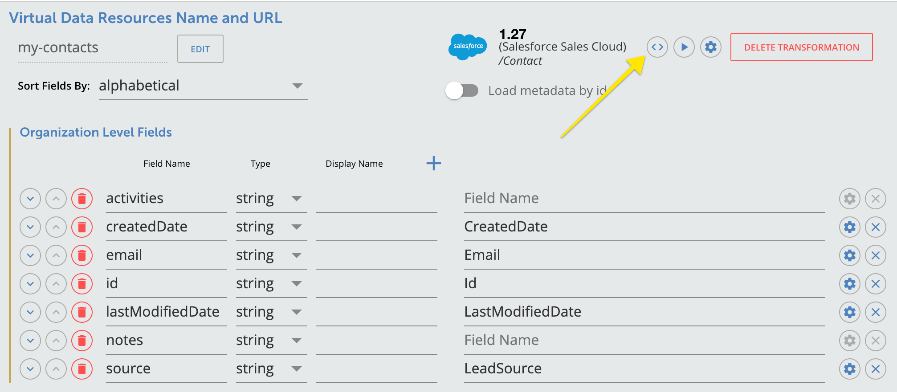

# Combine Multiple Objects in to a Single Virtual Data Resource (VDR)
This is an example for users familiar with Cloud Elements Virtual Data Resources to expand their resources to be able to combine data from one or more discrete objects into a single resource. In other words, instead of making a call to the /contacts endpoint, then making two calls for each contact to fetch their respective notes and activities, the requests can be combined in a single VDR.

### Terminology:
Parent VDR - VDR called from the consuming application (in this case a VDR called `my-contacts`)
Child VDR - VDR or resource called via Javascript in the parent VDR, the response will be merged into the parent VDR's response (`my-contact-activities` and `my-contact-notes`)

Typically the parent VDR contains information needed to make the child API calls, such as an ID which is a reference to the object you would like to merge in the parent VDR.

### Things to note in this example:
1. vdr.js
  * can be added to your custom Javascript to invoke another VDR or another resource on the element instance.

  * Has fields that may be edited to meet your needs including path which can be changed depending on the resource you are calling, the ID used in the call to the child VDR, and the field in the parent VDR to add the results. In this case we are calling a VDR named `my-contacts` then getting the notes and activities for each contact in the response.
2. Alternatively, create an instance of Salesforce Sales Cloud, and import the parent and child VDRs (`{objectName}-objectDefinition.json` and `{objectName}-transformation.json`)
  * Instructions for importing the VDR into your environment can be found [here](https://docs.cloud-elements.com/home/exporting-and-importing-transformations-and-objects-between-environments)

### Limitations with this approach:
1. The Javascript will timeout after 30 seconds, use a smaller pageSize on the request.
2. Errors from the child API calls are returned in the response for the parent VDR, thus the consuming application will need to account for the case were one or all child API calls failed, but the parent API call was successful.
3. Be mindful of any concurrency limits of the provider's API.