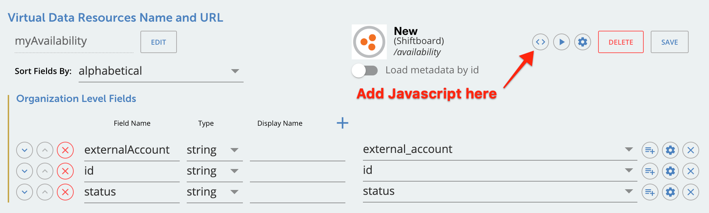
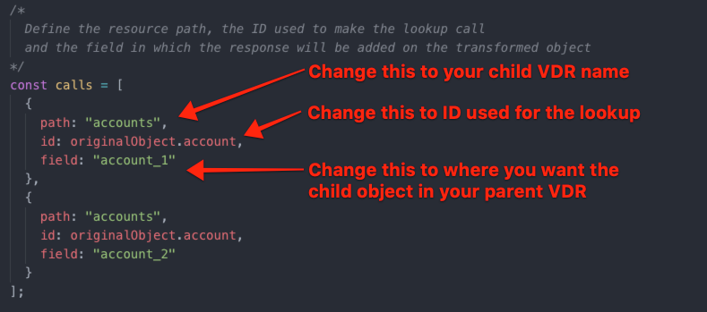

# Using Promise.all to Combine Multiple Objects in to a Single Virtual Data Resource (VDR)
This is an example for users familiar with Cloud Elements Virtual Data Resources to expand their resources to be able to combine data from multiple discrete objects into a single resource. In other words, instead of making a call to a /availability endpoint, then making two calls to the /accounts endpoint, the requests can be combined in a single VDR. If you only need to merge a single object, you should use this example [here](https://github.com/CloudElementsOpenLabs/vdrs/tree/master/combining-objects). If you need to merge multiple objects into a single VDR this guide is for you.

### Terminology:
Parent VDR - VDR called from the consuming application.
Child VDR - VDR or resource called via Javascript in the parent VDR, the response will be merged into the parent VDR's response.

Typically the parent VDR contains information needed to make the child API calls, such as a ID which is a reference to the object you would like to merge in the parent VDR.

### Things to note in this example:
1. vdrPromiseExample1.js and vdrPromiseExample2.js
  * can be added to your custom Javascript to invoke another VDR or another resource on the element instance.

  * Has fields that may be edited to meet your needs including path which can be changed depending on the resource you are calling, the ID used in the call to the child VDR, and the field in the parent VDR to add the results. In this case we are calling a resource called availability and getting the account by the ID.
2. To use this you should create your own transformations, though you could call the element instance without it.
  * If you want to use the provided code you will want to make a VDR called /availability (parent) and a second VDR (that we called /accounts - child). Include the provided Javascript in the parent VDR.
  * Otherwise you can use this with your own VDRs but you will need to edit the example Javascript anywhere there's an object name or a field name (see image below for more details)
  

### Example 1 vs. Example 2
In example 1, the entire response from the child call is inserted into the `transformedObject` in the defined key.  Example 2 is more complex, but allows for additional formatting of the response from the child call before the data is inserted into the `transformedObject`.

### Limitations with this approach:
1. The Javascript will timeout after 30 seconds, use a smaller pageSize on the request.
2. Errors from the child API calls are returned in the response for the parent VDR, thus the consuming application will need to account for the case were one or all child API calls failed, but the parent API call was successful.
3. Be mindful of any concurrency limits of the provider's API.

### How do I make the request fail if there is an error from a child API call?
In some cases, you may want the entire request to fail instead of returning errors from child API calls in the `transformedObject`.

In the JavaScript:
```
throw new Error('Your error message with context regarding request');
```

In the case of an error, the response from Cloud Elements:
```
{
  "requestId": "5db2f26ee4b02bd2e4dc6fa5",
  "message": "Javascript failed to execute: Your error message with context regarding request"
}
```